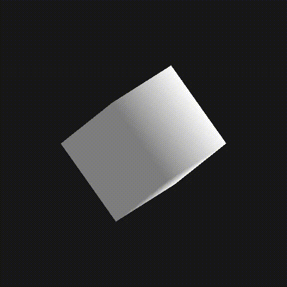
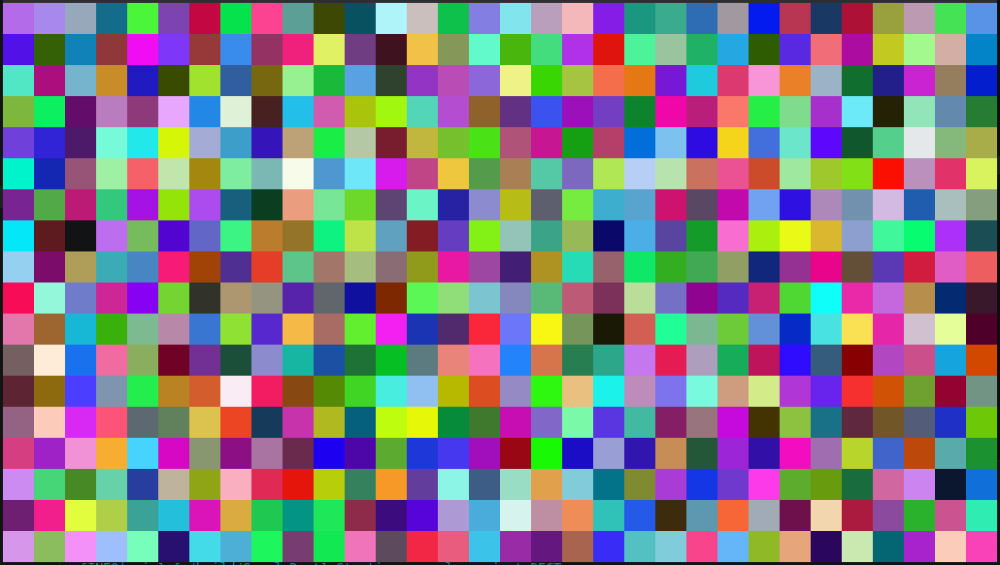

# Sargasso Engine

An experimental 3D graphics engine made for fun and learning!

I wanted to see how difficult it would be to make a library that lets you implement generic geometry rendering. In theory you could expand this to load `.obj` files!

Simple, made in OpenGL, powered by GLFW. You gotta input those raw pieces of vertex data, baby.

See examples in the examples folder. There are currently 2 examples:

- SampleCube: a rotating cube.

- SampleRect: just randomly coloured rects.

## Usage

First make sure to update your submodules (`git submodule update --init --recursive`).

Run `cmake` with `-DCMAKE_POLICY_VERSION_MINIMUM=3.5` (because `physfs` is a dependency and it's hella old and `cmake` is super annoying). I use `-Werror` and that changes between compilers so if it's giving out any warnings as errors just try removing that from `CMakeLists.txt`.

By default the root `CMakeLists.txt` compiles the examples. But to use it you should include the `CMakeLists.txt` in the `src/` directory instead. Uhh I realise this is a library but I'm not using the `include` directory standard. Put that on my to-do list.

So basically you extend the `sargasso::Engine` class in your own code and override its methods (mainly `load`, `update`, and `draw`).

## Why do this

For funsies.

I learned a lot about OpenGL. And now looking back at this I realize how terrible memory management it has. How do you deal with CPU vs GPU memory? Do you store all in one and send to the other as neeed? That's expensive! Sending stuff to GPU and freeing up memory as needed is not a trivial task at all. Especially given how ugly OpenGL's API is. Of course there is always worse.

Isn't computer graphics fun?

## Related projects

In order to do this project, I ended up making my own math library for computer graphics. Which sent me on a Linear Algebra deep dive. Check out the results at [Slippy's Math Library](https://github.com/aki-cat/sml). And to do THAT, I ended up making a test library, which you can check at [Beltino's Test Library](https://github.com/aki-cat/btl).

